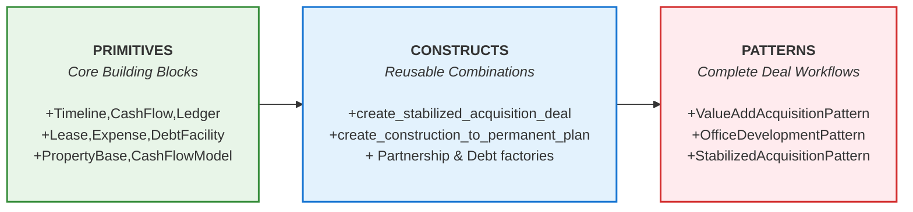

# Development Guide

This guide covers everything you need to know for developing with and contributing to Performa.

## Quick Start

The fastest way to get started with development:

```bash
git clone https://github.com/performa-dev/performa.git
cd performa
make dev-setup
```

This single command will:

- Set up asdf and install the correct Python version
- Create a virtual environment using uv
- Install all dependencies (including dev dependencies)
- Install the package in editable mode

Verify everything is working:

```bash
make check
```

## Installation for Development

### Recommended: Using the Makefile

```bash
# Complete development environment setup
make dev-setup

# Or step by step:
make asdf-bootstrap  # Set up asdf and Python
make venv           # Create virtual environment
make install        # Install dependencies
```

### From Source (Alternative Method)

```bash
git clone https://github.com/performa-dev/performa.git
cd performa
pip install -e .
```

This installs Performa in editable mode, allowing you to make changes to the source code and immediately see the effects without needing to reinstall.

### Development Environment Setup

#### Using `uv` with Makefile (Recommended)

Our Makefile provides convenient targets for all development tasks:

```bash
# Install dev dependencies (recommended for most development)
make install

# Install ALL dependency groups (current and future: docs, viz, etc.)
make install-all

# Install only production dependencies
make install-prod

# Update all dependencies to latest compatible versions
make update
```

#### Manual Setup with `uv`

If you prefer manual setup, `uv` is a fast Python package installer and resolver:

```bash
# Install all dependency groups (recommended for full development setup)
pip install uv
uv sync --all-extras

# Or install only specific groups
uv sync --extra dev  # Development tools only
```

#### Individual Dependency Groups

You can install specific dependency groups based on your needs:

```bash
# Core dependencies only
uv sync

# Development tools (linting, formatting, testing, etc.)
uv sync --extra dev

# All extras (current: dev; future: docs, viz, etc.)
uv sync --all-extras
```

**Note:** Additional dependency groups like `docs`, `viz`, and others may be added in the future. Use `--all-extras` to ensure you get everything.

#### Alternative Setup Methods

**Coming Soon**: Additional setup options for:

- `asdf` for Python version management
- Virtual environment configuration (`venv`, `conda`, etc.)
- Pre-commit hooks and code formatting
- IDE configuration

## Project Structure

```bash
performa/
├── src/performa/     # Main library code
│   ├── analysis/     # Analysis engine and orchestration
│   ├── asset/        # Asset-specific models (office, residential, etc.)
│   ├── core/         # Core primitives and base classes
│   ├── deal/         # Deal structuring and partnerships
│   ├── debt/         # Debt and financing models
│   ├── development/  # Development project modeling
│   ├── reporting/    # Reporting and visualization
│   └── valuation/    # Valuation methodologies
├── tests/            # Test suite
│   ├── unit/         # Unit tests
│   ├── integration/  # Integration tests
│   └── e2e/          # End-to-end tests
├── examples/         # Usage examples, including notebooks
└── docs/             # Additional documentation
```

## Logging for (Software) Developers

`performa` uses Python's standard `logging` module to emit informative messages about operations, warnings, and errors. The library gets logger instances but does **not** configure logging handlers by default, leaving that responsibility to the consuming application.

### Basic Logging Setup

```python
import logging
import performa

# Configure logging for your application
logging.basicConfig(
    level=logging.DEBUG,
    format='%(asctime)s - %(name)s - %(levelname)s - %(message)s'
)

# Optional: Set specific level for performa logs
logging.getLogger("performa").setLevel(logging.INFO)

# Optional: More granular control
logging.getLogger("performa.analysis").setLevel(logging.DEBUG)
logging.getLogger("performa.asset").setLevel(logging.INFO)
```

### Advanced Logging Configuration

For production applications, you may want more sophisticated logging:

```python
import logging.config

LOGGING_CONFIG = {
    'version': 1,
    'disable_existing_loggers': False,
    'formatters': {
        'detailed': {
            'format': '%(asctime)s - %(name)s - %(levelname)s - %(funcName)s:%(lineno)d - %(message)s'
        },
        'simple': {
            'format': '%(levelname)s - %(message)s'
        }
    },
    'handlers': {
        'console': {
            'class': 'logging.StreamHandler',
            'level': 'INFO',
            'formatter': 'simple',
            'stream': 'ext://sys.stdout'
        },
        'file': {
            'class': 'logging.FileHandler',
            'level': 'DEBUG',
            'formatter': 'detailed',
            'filename': 'performa.log',
        }
    },
    'loggers': {
        'performa': {
            'level': 'DEBUG',
            'handlers': ['console', 'file'],
            'propagate': False
        }
    }
}

logging.config.dictConfig(LOGGING_CONFIG)
```

### Logger Hierarchy

Performa uses a hierarchical logger structure:

- `performa` - Root logger
  - `performa.analysis` - Analysis engine
    - `performa.analysis.orchestrator` - Cash flow orchestration
    - `performa.analysis.scenario` - Analysis scenarios
  - `performa.asset` - Asset models
    - `performa.asset.office` - Office properties
    - `performa.asset.residential` - Residential properties
  - `performa.core` - Core primitives
  - `performa.deal` - Deal structuring
  - `performa.debt` - Debt modeling

## Testing

### Running Tests

Use the Makefile for convenient testing:

```bash
# Run all tests
make test

# Run tests with coverage report
make test-cov

# Manual testing with pytest
uv run pytest
uv run pytest --cov=performa --cov-report=html
```

### Running Tests Manually

```bash
# Run all tests
pytest

# Run specific test categories
pytest tests/unit/
pytest tests/integration/
pytest tests/e2e/

# Run with coverage
pytest --cov=performa --cov-report=html
```

### Writing Tests

Performa uses pytest for testing. Follow these patterns:

```python
import pytest
from performa.core.primitives import Timeline

def test_timeline_creation():
    timeline = Timeline.from_dates('2024-01-01', '2024-12-31')
    assert len(timeline.period_index) == 12

class TestOfficeProperty:
    def test_property_creation(self):
        # Test implementation
        pass
```

## Code Standards

### Linting and Formatting

Use the Makefile for code quality checks:

```bash
# Check code style and formatting
make lint

# Automatically fix code style issues
make lint-fix
```

Manual commands:

```bash
# Check with ruff
uv run ruff check .
uv run ruff format --check .

# Auto-fix with ruff
uv run ruff check --fix .
uv run ruff format .
```

### Python Style Guide

Performa follows these coding standards:

- **PEP 8** for Python style
- **Type hints** for all public APIs
- **Docstrings** for all public classes and methods
- **Pydantic models** for all data structures
- **pytest** for testing

### Documentation Standards

- **Module READMEs**: Each major module has a README.md explaining its purpose
- **Inline documentation**: Comprehensive docstrings with examples
- **Type annotations**: Full type coverage for public APIs
- **Examples**: Working code examples in docstrings and README files

### Import Organization

```python
# Standard library imports
from datetime import date
from typing import Optional, List

# Third-party imports
import pandas as pd
from pydantic import Field

# Performa imports
from performa.core.primitives import Model
from performa.core.base import PropertyBaseModel
```

## Contributing Workflow

### Setting Up for Contribution

1. **Fork the repository** on GitHub
2. **Clone your fork** locally
3. **Create a feature branch** from `main`
4. **Set up development environment**: `make dev-setup`
5. **Verify setup**: `make check`
6. **Make your changes**
7. **Run quality checks**: `make lint test`
8. **Submit a pull request**

### Pull Request Guidelines

- **Clear description** of what the PR accomplishes
- **Reference any issues** being addressed
- **Include tests** for new functionality: `make test`
- **Ensure code quality**: `make lint-fix`
- **Update documentation** as needed
- **Follow the established code style**

### Development Workflow Commands

```bash
# Daily development workflow
make lint-fix    # Fix any style issues
make test        # Run tests
make check       # Verify setup

# Clean up when needed
make clean       # Remove temporary files
make clean-all   # Full cleanup including venv
```

### Release Process

**Coming Soon**: Detailed release procedures including:

- Version bumping strategy
- Changelog maintenance
- PyPI deployment process
- Documentation updates

## Architecture Guidelines

### Design Principles

When contributing to Performa, keep these principles in mind:

1. **Transparency**: All calculations should be auditable and traceable
2. **Composability**: Components should work together seamlessly
3. **Type Safety**: Use Pydantic models and type hints extensively
4. **Performance**: Consider performance implications of design decisions
5. **Standards**: Follow real estate industry standards and terminology

### Pydantic Best Practices

```python
from pydantic import Field, computed_field, model_validator
from typing import Optional

class ExampleModel(Model):
    """Clear, concise description of what this model represents."""
    
    # Required fields first
    name: str = Field(..., description="Human-readable name")
    value: float = Field(..., gt=0, description="Positive value")
    
    # Optional fields with defaults
    description: Optional[str] = Field(None, description="Optional description")
    
    @computed_field
    @property
    def computed_value(self) -> float:
        """Computed properties for derived values."""
        return self.value * 1.1
    
    @model_validator(mode='after')
    def _validate_business_rules(self) -> 'ExampleModel':
        """Custom validation for business logic."""
        if self.value > 1000:
            raise ValueError("Value cannot exceed 1000")
        return self
```

### Three-Tier Architecture: Primitives, Constructs, and Patterns

Performa follows a three-tier architectural approach that provides flexibility for different use cases, from detailed custom modeling to high-level deal creation:



*The Performa library is designed with a three-tier architecture, allowing you to work at the level of abstraction that best suits your needs, from detailed control with Primitives to rapid deal workflows with [Patterns](/src/performa/patterns/README.md).*

#### Tier 1: Primitives (Core Building Blocks)

**Location**: `src/performa/core/primitives/`

Primitives are the foundational building blocks of the library - immutable, type-safe models that handle basic real estate concepts:

```python
from performa.core.primitives import Timeline, CashFlow, Model
from datetime import date

# Core temporal modeling
timeline = Timeline.from_dates('2024-01-01', '2029-12-31')

# Financial data structures
cash_flow = CashFlow(values=[100, 200, 300], timeline=timeline)

# Base model with validation
class CustomModel(Model):
    name: str
    value: float = Field(gt=0)
```

**Key Primitives**:
- `Timeline` - Temporal indexing and date management
- `CashFlow` - Financial series with time-based operations
- `Model` - Base Pydantic model with immutability (`frozen=True`)
- `DrawSchedule` - Cost distribution over time
- `GrowthRate` - Escalation and appreciation modeling
- Type constraints (`PositiveFloat`, `FloatBetween0And1`, etc.)

**When to use**: Building custom models, extending the library, or when you need maximum control over every component.

#### Tier 2: Constructs (Reusable Components)

**Location**: `src/performa/deal/constructs.py`, `src/performa/debt/constructs.py`

Constructs combine primitives into higher-level, reusable components that handle common real estate workflows:

```python
from performa.deal.constructs import create_simple_partnership
from performa.debt.constructs import create_construction_to_permanent_plan

# Create a standard GP/LP partnership
partnership = create_simple_partnership(
    gp_name="Sponsor LLC",
    lp_name="Investor Fund",
    gp_share=0.20,
    lp_share=0.80,
    distribution_method="waterfall"
)

# Create a construction-to-permanent financing structure
financing = create_construction_to_permanent_plan(
    construction_terms={
        "ltc_threshold": 0.75,
        "interest_rate": 0.075,
        "term_months": 24
    },
    permanent_terms={
        "loan_amount": 5_000_000,
        "interest_rate": 0.055,
        "loan_term_years": 10
    }
)
```

**Key Constructs**:
- `create_simple_partnership()` - Standard GP/LP structures
- `create_construction_to_permanent_plan()` - Combined loan facilities
- `create_debt_facility()` - Custom debt structures
- Asset-specific builders for complex property models

**When to use**: Building custom deals with standard components, or when you need more control than patterns provide but don't want to build everything from scratch.

#### Tier 3: Patterns (Complete Deal Archetypes)

**Location**: `src/performa/patterns/`

Patterns are the highest abstraction level - complete, parameter-driven deal creation for common investment strategies:

```python
from performa.patterns import ValueAddAcquisitionPattern
from datetime import date

# Create a complete value-add deal with a few parameters
pattern = ValueAddAcquisitionPattern(
    property_name="Riverside Apartments",
    acquisition_date=date(2024, 1, 1),
    acquisition_price=8_000_000,
    renovation_budget=1_200_000,
    current_avg_rent=1400,
    target_avg_rent=1750,
    hold_period_years=5,
    ltv_ratio=0.70
)

# One-line deal creation and analysis
results = pattern.analyze()
print(f"IRR: {results.deal_metrics.irr:.2%}")
print(f"Equity Multiple: {results.deal_metrics.equity_multiple:.2f}x")
```

**Available Patterns**:
- `ValueAddAcquisitionPattern` - Acquire, renovate, stabilize, sell
- `StabilizedAcquisitionPattern` - Buy-and-hold stabilized properties  
- `DevelopmentPattern` - Ground-up development projects

**When to use**: Rapid deal analysis, sensitivity studies, or when working with standard investment strategies. Perfect for underwriting, presentations, and high-level feasibility analysis.

#### Choosing the Right Tier

| Use Case | Recommended Tier | Example |
|----------|------------------|---------|
| Custom property types not yet supported | **Primitives** | Specialized industrial, hospitality, or mixed-use |
| Standard deals with custom components | **Constructs** | Acquisition with exotic financing or partnership terms |
| Common investment strategies | **Patterns** | Standard multifamily value-add or office acquisition |
| Rapid underwriting and sensitivity analysis | **Patterns** | Investment committee presentations, deal screening |
| Library extension and new features | **Primitives + Constructs** | Adding new asset classes or financing types |

#### Integration Between Tiers

All tiers are designed to work together seamlessly:

```python
# Start with a Pattern for speed
pattern = ValueAddAcquisitionPattern(...)
base_deal = pattern.create()

# Customize with Constructs if needed
from performa.debt.constructs import create_mezzanine_facility
mezz_debt = create_mezzanine_facility(...)
base_deal = base_deal.copy(update={"additional_financing": mezz_debt})

# Fine-tune with Primitives for maximum control
custom_timeline = Timeline(start_date=date(2024, 6, 1), duration_months=72)
results = analyze(base_deal, custom_timeline)
```

This tiered approach ensures that Performa scales from rapid prototyping to detailed institutional modeling while maintaining consistency and type safety throughout.

## Getting Help

- **GitHub Issues**: Report bugs and request features
- **GitHub Discussions**: Ask questions and share ideas
- **Documentation**: Start with module README files
- **Examples**: Check the `/examples` directory
- **Community**: Join our community channels (coming soon)

## License and CLA

- **License**: Apache 2.0 (see [LICENSE](LICENSE))
- **Contributing Agreement**: CLA process (coming soon)
- **Code of Conduct**: See [CODE_OF_CONDUCT.md](CODE_OF_CONDUCT.md)
