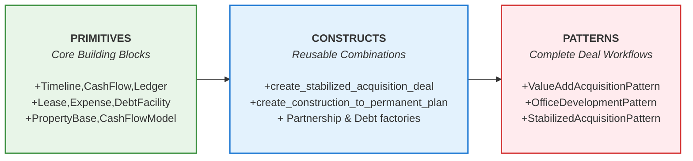

  

  <picture>
    <source media="(prefers-color-scheme: dark)" srcset="docs/wordmark-dark.svg">
    <source media="(prefers-color-scheme: light)" srcset="docs/wordmark-light.svg">
    
  </picture>

 

  <em>An open standard for real estate financial modeling — transparent, composable, and AI-ready</em>

  

    
    
    
    
    
  

 

<!-- # Performa -->

**Performa** is an open-source Python library providing composable building blocks and standardized conventions for real estate financial modeling. It is designed to be a common protocol for analysts, sponsors, investors, financiers, as well as AI assistants and agentic systems.

For decades, real estate finance has been powered by spreadsheets and proprietary "black box" software. But today, the industry stands at an inflection point. The dawn of the AI era demands models that are not just human-readable, but also machine-executable — a "glass box" approach that is transparent, auditable, and extensible.

Highlights:

- 💎 **Glass box transparency**: Every calculation is explicit and auditable—no hidden formulae
- 🏢 **Asset-centric modeling**: Deep expertise for office, residential, retail, etc.
- 🤝 **Deal structuring**: Partnership waterfalls, debt facilities, and acquisition modeling
- 💰 **Financing facilities**: Construction loans, permanent debt, and complex structures
- 📈 **Comprehensive valuation**: DCF, direct cap, and sales comparison methods
- 🏗️ **Development lifecycle**: Full project modeling from construction to stabilization
- 🧩 **Composable and extensible**: Connect components for quick scripts or complex apps
- 🐍 **Fully Pythonic**: modern language for data science and financial modeling
- ⏳ **Git-friendly**: version control for your models and assumptions
- 🤖 **Purpose-built for AI**: Structured data models that speak the native language of LLMs

 

  

  <em>Demo notebooks visually exploring real estate concepts using Performa building blocks</em>

 

## 💥 Why Performa? An Industry at an Inflection Point

For decades, real estate finance has been powered by two remarkable tools: the infinite flexibility of the [spreadsheet](https://www.hyperindexed.com/blog/2018/7/31/visicalcs-enduring-vision) and the institutional acceptance of proprietary "black box" software. These tools built the modern real estate world. But today, our industry stands at an inflection point, much like the derivatives market did before the [ISDA Common Domain Model (CDM)](https://github.com/finos/common-domain-model) created a universal language for complex trades.

Every transaction involves the same frustrating dance: sponsor, lender, and investor each rebuild the financial model in their own format just to trust the numbers and logic. This creates friction, wastes valuable time, introduces risk, and makes the market less liquid.

**`performa` aims to be the lingua franca for real estate project economics.**

This comes at a pivotal moment: the _dawn of the AI era_ and the _maturation of data science tooling_. We can speak plain language to create complex models with rules, and with `performa` we get guardrails and reproducibility - not ad hoc AI slop or hallucinations. And now, with breakthrough work in [Pyodide](https://pyodide.org/) and [WASM](https://webassembly.org/), we can run Python - the stalwart language of data science - trivially, in a web browser.

 

## 🧱 What is Performa

`performa` provides "Lego brick" components where each piece — a lease, expense, loan — is a validated Pydantic data model that connects seamlessly with others. Every input is validated and every calculation is explicit Python code you can audit and trust.

Performa packages these building blocks in a [three-tier architectural approach](DEVELOPMENT.md#three-tier-architecture-primitives-constructs-and-patterns) that provides flexibility for different use cases, from low-level custom modeling to high-level workflows for standard use cases:

 

### What does this mean for you?

**For Analysts & Sponsors:** Spend less time on boilerplate logic and debugging formulas, and more time on what matters: the assumptions, the strategy, and the deal itself. Move from being a "spreadsheet jockey" to an architect of value. 🤓

**For Institutions & Stakeholders:** Drastically reduce transaction friction. When the sponsor, the underwriter, the broker, the lender, and the investor all speak the same language, diligence becomes faster, risk is minimized, and capital can move more freely and efficiently. 💰

**For Students & Educators:** Learn financial modeling and real estate concepts in a structured way, with a common language and a common set of tools. No more passing around a stranger's spreadsheet with mysterious logic. And no more paying for educational materials, tutorials, or software trial periods! 🤬

**For the AI-Powered Future:** Stop trying to teach your AI assistant how to decipher a spreadsheet; stop trying to ask your AI assistant to build one-off calculations from scratch again and again with mixed results – on more reinventing the wheel! Instead, give your AI the building blocks it understands natively, _in code_. Performa is the "math co-processor" for real estate AI, helping turn natural language requests into institutional-grade, auditable financial models with deterministic results. 🤖

 

## 🏎️ Installation & Usage

See detailed installation instructions in the [Development & Usage Guide](DEVELOPMENT.md).

> [!CAUTION]
> **Pre-Alpha Status:** This project is under active development. Breaking changes are expected; APIs and data structures may change significantly. Validation testing is in progress. Comments, feedback, and contributions are most welcome! 🚧

 

## 🙏 Contributing & Call for Feedback

This project is in active development. Feedback from real estate professionals, developers, and academics is essential.

[Development Guide](DEVELOPMENT.md) • [Contributing](CONTRIBUTING.md) • [License](LICENSE)

## Inspiration ✨

Performa is a **reinvention** of the real estate financial model as a reproducible, interactive, auditable, shareable application instead of an error-prone spreadsheet. It is a protocol designed to be the common language for the next generation of analysts, developers, investors, and AI assistants.

Tooling matters; the tools we use shape the way we think - better tools, better minds, better outcomes. With Performa, we hope to provide the real estate community with a better structure with which to imagine the built future and to communicate it, to experiment with code and to share it; to learn financial modeling and to teach it.

Our inspiration comes from countless sources, but especially [Pydantic](https://docs.pydantic.dev/)'s data modeling standards, dataviz and abstractions in [Observable](https://observablehq.com/) + [Plot](https://observablehq.com/plot/) + [D3](https://d3js.org/), [marimo](https://marimo.io/), array math in [Numpy](https://numpy.org/) and [Pandas](https://pandas.pydata.org/), data apps in [streamlit](https://github.com/streamlit/streamlit), data ETL in [Airflow](https://airflow.apache.org/) and [DAG](https://en.wikipedia.org/wiki/Directed_acyclic_graph)s, statistics in [R](https://www.r-project.org/), configuration and convention in [Kubernetes](https://kubernetes.io/), Infrastructure as Code in [AWS CDK](https://aws.amazon.com/cdk/), and more esoteric terrain like [geospatial FOSS](https://www.osgeo.org/) (maps and geoprocessing), and [EnergyPlus](https://energyplus.net/) (building energy modeling).

 

---

## 📝 Note from the Author

My name is [Dave](https://github.com/dnix) 👋. I like building useful tech for real estate and energy. My goal with [Performa](https://github.com/dnix/performa) is to nudge the real estate industry beyond brittle spreadsheets and black-box software -- toward a standard protocol.

There is a better way. Let's build it together! 🚀

 

  <picture>
    <source media="(prefers-color-scheme: dark)" srcset="docs/wordmark-dark.svg">
    <source media="(prefers-color-scheme: light)" srcset="docs/wordmark-light.svg">
    
  </picture>

