# Performa `analysis` Engine

This module provides the core analysis engine for Performa, implementing the orchestrator
pattern for cash flow calculations and the scenario pattern for property analysis.

## Key Components

- **AnalysisScenarioBase**: Base class for asset-specific analysis scenarios
- **CashFlowOrchestrator**: Executes multi-phase cash flow calculations with dependency resolution
- **AnalysisContext**: Universal data bus for analysis state and resolved object references
- **Registry**: Maps model types to their appropriate analysis scenarios

## Architecture

The analysis engine implements a dependency-aware multipass calculation system:

```mermaid
%%{ init : { "theme" : "default" }}%%
graph TD
    subgraph wrap [" "]
        subgraph input ["ANALYSIS PREPARATION"]
            A[Model Input<br/><i>Property, Timeline, Settings</i>]
            B[Registry Lookup<br/><i>Select AnalysisScenario</i>]
            C[UUID Resolution<br/><i>Object Reference Assembly</i>]
            D[AnalysisContext<br/><i>Universal Data Bus</i>]
        end

        subgraph engine ["MULTIPASS ORCHESTRATOR"]
            E[Dependency Analysis<br/><i>Topological Sort</i>]
            F[Pass 1: Independent Models<br/><i>No Dependencies</i>]
            G[Pass 2: Dependent Models<br/><i>Requires Pass 1 Results</i>]  
            H[Pass 3: Higher-Order<br/><i>Requires Pass 2 Results</i>]
        end

        subgraph output ["RESULT AGGREGATION"]
            I[Cash Flow Assembly<br/><i>Series Combination</i>]
            J[Ledger Construction<br/><i>Transaction Recording</i>]
            K[Summary Generation<br/><i>Financial Statements</i>]
        end
    end

    A --> B
    B --> C
    C --> D
    D --> E
    
    E --> F
    E --> G
    E --> H
    
    F --> I
    G --> I
    H --> I
    
    I --> J
    J --> K

    %% Analysis Preparation - Gray theme
    style A fill:#f5f5f5,stroke:#666,stroke-width:2px
    style B fill:#f5f5f5,stroke:#666,stroke-width:2px
    style C fill:#f5f5f5,stroke:#666,stroke-width:2px
    style D fill:#f5f5f5,stroke:#666,stroke-width:2px
    
    %% Multipass Orchestrator - Progressive colors (existing)
    style E fill:#fff3cd,stroke:#856404,stroke-width:2px
    style F fill:#e8f5e8,stroke:#388e3c,stroke-width:2px
    style G fill:#e3f2fd,stroke:#1976d2,stroke-width:2px
    style H fill:#ffebee,stroke:#d32f2f,stroke-width:2px
    
    %% Result Aggregation - Green theme
    style I fill:#e8f5e8,stroke:#4caf50,stroke-width:2px
    style J fill:#e8f5e8,stroke:#4caf50,stroke-width:2px
    style K fill:#e8f5e8,stroke:#4caf50,stroke-width:2px
    
    %% Style subgraphs
    style wrap fill:#f8f9fa,stroke-width:0px
    style input fill:#f5f5f5,stroke:#999,stroke-width:1px
    style engine fill:#fff8e1,stroke:#f57c00,stroke-width:1px
    style output fill:#f1f8e9,stroke:#4caf50,stroke-width:1px
```



*The analysis engine uses topological sorting to resolve dependencies between cash flow models, executing calculations in multiple passes where each pass can safely assume all its dependencies have been computed.*

### Key Features

**🔄 Topological Sorting**: The orchestrator analyzes cash flow model dependencies and automatically determines the correct execution order, ensuring no model calculates before its dependencies are ready.

**📊 Multipass Execution**: 
- **Pass 1**: Independent models (leases, expenses, misc income) with no dependencies
- **Pass 2**: Models requiring Pass 1 results (recovery calculations, rollover analysis)  
- **Pass 3**: Higher-order models requiring Pass 2 results (complex interdependent calculations)

**🔗 Dependency Resolution**: Models declare their dependencies through UUID references, which the engine resolves to direct object references and uses for topological sorting.

**📋 Universal Data Bus**: AnalysisContext maintains resolved object maps and calculation state, providing efficient access for all models during execution.

### Execution Flow

1. **Analysis Preparation**: Registry selects appropriate scenario, resolves UUIDs, builds AnalysisContext
2. **Dependency Analysis**: CashFlowOrchestrator performs topological sort of models by dependencies  
3. **Multipass Calculation**: Execute models in dependency-safe order across multiple passes
4. **Result Aggregation**: Combine cash flows, build transactional ledger, generate financial statements

## Example Usage

```python
from performa.analysis import run
from performa.asset.office import OfficeProperty
from performa.core.primitives import Timeline, GlobalSettings

# Run analysis for any property type
scenario = run(
    model=office_property,
    timeline=Timeline.from_dates('2024-01-01', '2033-12-31'),
    settings=GlobalSettings()
)

# Get results
summary = scenario.summary_df
```

The analysis engine automatically selects the appropriate scenario based on model type
and handles all the complexity of cash flow orchestration and dependency resolution. 