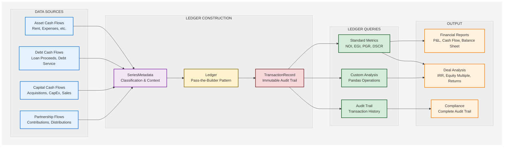
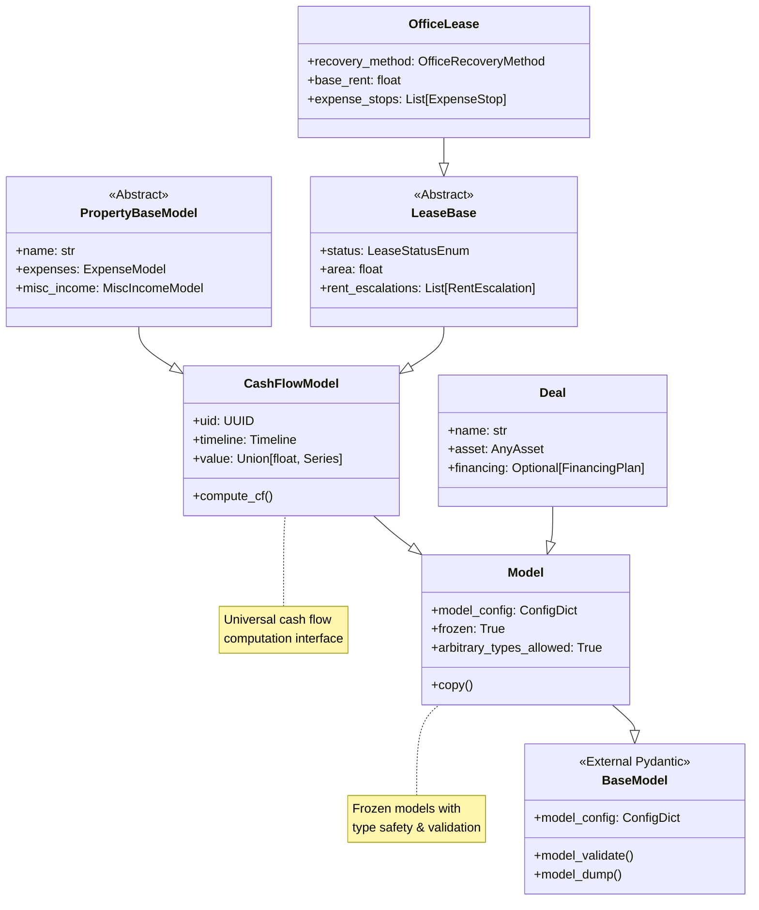

# Performa `core` Framework

This module provides the foundational building blocks for all real estate financial modeling in Performa. It contains the essential primitives, base classes, capital planning tools, and the transactional ledger system that enables property analysis and development modeling.

## Key Components

### Transactional Ledger System (`performa.core.ledger`)
- **Ledger**: Progressive ledger construction with pass-the-builder pattern
- **TransactionRecord**: Immutable atomic transaction units with full auditability
- **LedgerQueries**: Clean semantic interface for financial metrics and analysis
- **SeriesMetadata**: Type-safe metadata for Series-to-transaction conversion
- **FlowPurposeMapper**: Business logic for transaction classification

### Base Classes (`performa.core.base`)
- **PropertyBaseModel**: Foundation for all property types
- **LeaseBase & LeaseSpecBase**: Lease modeling infrastructure 
- **CashFlowModel**: Universal cash flow calculation engine
- **Recovery, expense, and revenue base classes**
- **Absorption and rollover modeling foundations**

### Primitives (`performa.core.primitives`)
- **Timeline**: Flexible timeline management for any analysis period
- **CashFlowModel**: Base for all cash flow calculations with growth and dependencies
- **GlobalSettings**: Configuration for analysis behavior and industry standards
- **Enums**: Enumerations for real estate modeling
- **Validation**: Reusable validation patterns

### Capital Planning (`performa.core.capital`)
- **CapitalPlan**: Coordinated capital project container with factory methods
- **CapitalItem**: Individual capital expenditure with flexible timing
- **DrawSchedule**: Cost distribution patterns (uniform, S-curve, etc.)

## Transactional Ledger Architecture

The ledger system replaces traditional wide-format DataFrames with an immutable, auditable record-based system that serves as the **single source of truth** for all financial calculations.



*The transactional ledger system provides complete audit trails by recording every financial event as immutable TransactionRecords, enabling both standard reporting and custom analysis.*

### Key Benefits

**🔍 Complete Transparency**: Every financial transaction is explicitly recorded with full audit trail
**📊 Simplified Reporting**: Reporting becomes querying, not re-calculating
**🏗️ Unified Architecture**: Single ledger supports all asset types and deal structures  
**⚡ Performance**: Optimized data structures with frozen dataclasses and slots
**🛡️ Data Integrity**: Immutable records prevent accidental data corruption

### Core Components

#### `TransactionRecord`
The atomic unit of the financial system - an immutable record of every financial event:

```python
@dataclass(frozen=True, slots=True)
class TransactionRecord:
    """Immutable record representing a single financial transaction."""
    
    # Core transaction data
    date: datetime.date
    amount: float                    # + = inflow, - = outflow
    flow_purpose: TransactionPurpose # Operating, Capital Use, etc.
    category: CashFlowCategoryEnum   # Revenue, Expense, Capital, etc.
    subcategory: Union[...]          # Rent, Utilities, etc.
    item_name: str                   # Descriptive transaction name
    
    # Full auditability
    transaction_id: UUID = field(default_factory=uuid4)
    source_id: UUID                  # Originating model
    asset_id: UUID                   # Associated asset
    pass_num: int                    # Calculation pass
```

#### `Ledger` 
Progressive ledger construction following the pass-the-builder pattern:

```python
from performa.core.ledger import Ledger, SeriesMetadata

# Create builder (passed through analysis context)
ledger = Ledger()

# Add cash flows with metadata
metadata = SeriesMetadata(
    category=CashFlowCategoryEnum.REVENUE,
    subcategory=RevenueSubcategoryEnum.LEASE,
    item_name="Base Rent",
    source_id=lease.uid,
    asset_id=property.uid,
    pass_num=1
)
ledger.add_series(rental_income_series, metadata)

# ledger owns the ledger - prevents data mismatches
ledger_df = ledger.ledger_df()
```

#### `LedgerQueries`
Clean semantic interface for standard real estate metrics:

```python
from performa.core.ledger import LedgerQueries

# Initialize with ledger DataFrame
queries = LedgerQueries(ledger_df)

# Standard real estate metrics via simple queries
potential_gross_revenue = queries.pgr()  # All revenue at 100% occupancy
gross_potential_rent = queries.gpr()     # Just rental income
effective_gross_income = queries.egi()   # Revenue less vacancy/credit loss
net_operating_income = queries.noi()     # EGI less operating expenses

# Capital and financing flows
capital_uses = queries.capital_uses()           # All capital expenditures
capital_sources = queries.capital_sources()     # All capital funding
loan_proceeds = queries.loan_proceeds()         # Debt funding
equity_contributions = queries.equity_contributions()  # Equity funding

# Custom queries using standard pandas operations
total_construction_cost = ledger[
    (ledger['category'] == 'Capital') & 
    (ledger['subcategory'] == 'Hard Costs')
]['amount'].sum()
```

### Integration with Analysis Engine

The ledger integrates with Performa's multi-pass analysis architecture:

**Pass 1: Independent Models** → Record base cash flows (rent, expenses, etc.)  
**Pass 2: Dependent Models** → Record derived flows (debt service, partnership distributions)  
**Pass 3: Analysis & Reporting** → Query ledger for metrics and summaries

```python
from performa.analysis import run
from performa.core.primitives import Timeline, GlobalSettings

# Analysis automatically builds ledger during calculation
results = run(property, timeline, GlobalSettings())

# Access ledger through results
ledger_queries = results.scenario.get_ledger_queries()
annual_noi = ledger_queries.noi().resample('Y').sum()

# Direct access to transaction records
all_transactions = ledger_queries.ledger
construction_costs = all_transactions[
    all_transactions['subcategory'] == 'Hard Costs'
]
```

### Transaction Classification System

The ledger uses a multi-level classification system:

**Level 1: `flow_purpose`** (High-level business purpose)
- `Operating`: Day-to-day property operations
- `Capital Use`: Capital expenditures and acquisitions  
- `Capital Source`: Capital funding and sales proceeds
- `Financing Service`: Debt service and financing costs
- `Valuation`: Non-cash appraisals and mark-to-market

**Level 2: `category`** (Primary financial category)  
- `Revenue`, `Expense`, `Capital`, `Financing`, `Valuation`

**Level 3: `subcategory`** (Detailed classification)
- Revenue: `Lease`, `Misc`, `Recovery`
- Expense: `Operating`, `Management`, `Taxes`, `Insurance`
- Capital: `Hard Costs`, `Soft Costs`, `Acquisition`, `TI`, `LC`
- Financing: `Loan Proceeds`, `Debt Service`, `Equity Contribution`

### Implementation Features

#### Series Preservation Performance
```python
# CashFlowModel instances continue returning pd.Series internally
rental_income = lease.compute_cf(context)  # Returns pd.Series

# Batch conversion to TransactionRecord at assembly stage
metadata = SeriesMetadata(category="Revenue", subcategory="Lease", ...)
builder.add_series(rental_income, metadata)  # Converted in batch
```

#### Pass-the-Builder Pattern
```python
def analyze_deal(deal, timeline, ledger):
    """All analysis functions require explicit ledger."""
    
    # Asset analysis writes to ledger
    asset_analysis = run_asset_analysis(deal.asset, timeline, ledger)
    
    # Debt analysis reads from and writes to same ledger
    debt_analysis = run_debt_analysis(deal.financing, timeline, ledger)
    
    # Single source of truth maintained throughout
    return DealAnalysisResult(
        asset_analysis=asset_analysis,
        debt_analysis=debt_analysis,
        ledger_queries=LedgerQueries(ledger.ledger_df())
    )
```

#### Audit Trail Capabilities
```python
# Complete transaction history for compliance
audit_trail = ledger_queries.ledger[[
    'transaction_id', 'date', 'amount', 'item_name', 
    'source_id', 'flow_purpose'
]]

# Trace specific transactions back to originating models
construction_audit = ledger_queries.ledger[
    ledger_queries.ledger['subcategory'] == 'Hard Costs'
][['date', 'amount', 'item_name', 'source_id']]
```

## Model Inheritance Architecture



*All Performa models follow a clear inheritance chain from a Pydantic-powered base Model, ensuring data validation, type safety, and a consistent API throughout the system.*

## Architecture Principles

- **Ledger-First Design**: All financial calculations flow through the transactional ledger
- **Composable Components**: Clear separation of concerns with unified integration
- **Immutable Records**: Transaction data cannot be accidentally modified
- **Type Safety**: Pydantic-based validation throughout the system
- **Timeline Consistency**: Proper period alignment across all components
- **Dependency Resolution**: Multi-pass calculations with clear ordering

## Example Usage

### Basic Ledger Integration

```python
from performa.core.primitives import Timeline, CashFlowModel, GlobalSettings
from performa.core.ledger import Ledger, SeriesMetadata
from performa.core.capital import CapitalPlan

# Analysis with automatic ledger construction
timeline = Timeline.from_dates('2024-01-01', '2029-12-31')
results = run(property, timeline, GlobalSettings())

# Query standard metrics
queries = results.scenario.get_ledger_queries()
noi_by_year = queries.noi().resample('Y').sum()
total_capital_uses = queries.capital_uses().sum()

# Custom transaction analysis
ledger = queries.ledger
monthly_rent = ledger[
    (ledger['category'] == 'Revenue') & 
    (ledger['subcategory'] == 'Lease')
].groupby('date')['amount'].sum()
```

### Manual Ledger Construction

```python
# Manual ledger construction for custom analysis
ledger = Ledger()

# Add custom transaction
from performa.core.ledger import TransactionRecord
custom_transaction = TransactionRecord(
    date=date(2024, 6, 15),
    amount=-50_000,
    flow_purpose=TransactionPurpose.CAPITAL_USE,
    category=CashFlowCategoryEnum.CAPITAL,
    subcategory=CapitalSubcategoryEnum.TI,
    item_name="Custom Tenant Improvement",
    source_id=uuid4(),
    asset_id=property.uid,
    pass_num=1
)
ledger.add_record(custom_transaction)

# Combine with Series data
renovation_costs = pd.Series([100_000, 150_000], 
                           index=pd.date_range('2024-01', periods=2, freq='M'))
metadata = SeriesMetadata(
    category=CashFlowCategoryEnum.CAPITAL,
    subcategory=CapitalSubcategoryEnum.HARD_COSTS,
    item_name="Renovation - Phase 1"
)
ledger.add_series(renovation_costs, metadata)

# Generate final ledger
final_ledger_df = ledger.ledger_df()
queries = LedgerQueries(final_ledger_df)
```

## Performance Characteristics

The ledger system is optimized for real estate financial modeling performance:

**Memory Efficiency**: Frozen dataclasses with `__slots__` reduce memory overhead
**Batch Processing**: Series-to-record conversion happens in optimized batches  
**Query Performance**: Standard pandas operations on well-indexed DataFrames
**Cache Friendly**: Immutable data structures enable aggressive caching

**Benchmarks** (typical development deal):
- ~10K transactions: <100ms ledger construction
- ~100K transactions: <500ms ledger construction  
- Query operations: <10ms for standard metrics

This core framework, anchored by the transactional ledger system, enables real estate financial modeling while maintaining transparency, auditability, and precision across the entire Performa ecosystem.
