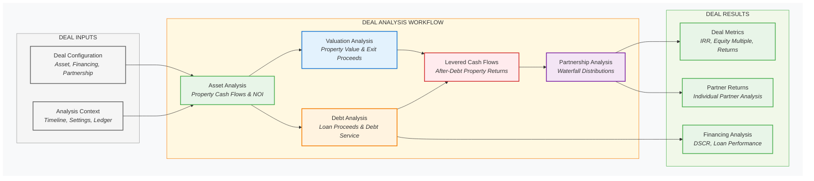

# Performa `deal` Models - Deal Structuring & Analysis

This module provides deal-level modeling capabilities for real estate transactions, supporting everything from simple acquisitions to complex multi-partner development ventures with waterfall structures. Built on the transactional ledger architecture for complete transparency and auditability.

## Key Components

### Core Deal Structure



*Deal analysis executes a multi-phase workflow where asset performance drives valuation, debt analysis, and ultimately partnership distributions, providing comprehensive investment analysis across all deal components.*

- **Deal**: Complete deal container with asset, debt, equity, and partnership integration
- **AcquisitionTerms**: Purchase price, closing costs, and transaction timing
- **DealFee**: Flexible fee structures (acquisition, asset management, disposition)

### Partnership & Waterfalls

```mermaid
%%{ init : { "theme" : "default" }}%%
graph TD
    subgraph wrap [" "]
        subgraph input ["CASH FLOW INPUT"]
            A[Levered Cash Flows<br/><i>Available for Distribution</i>]
        end

        subgraph waterfall ["WATERFALL DISTRIBUTION"]
            B{Capital Return<br/><i>Complete?</i>}
            C[Return of Capital<br/><i>Pro Rata to Partners</i>]
            D[Remaining Cash Flow<br/><i>After Capital Return</i>]
            E[Available Cash<br/><i>Ready for Distribution</i>]
            F{Preferred Return<br/><i>8% Met?</i>}
            G[Preferred Return<br/><i>to LPs at 8%</i>]
            H{GP Catch-up<br/><i>Complete?</i>}
            J[GP Catch-up<br/><i>100% to GP</i>]
            K[Promote Distribution<br/><i>Split Analysis</i>]
            L[Remaining Cash<br/><i>To Promote Tiers</i>]
            M{IRR Threshold<br/><i>Performance Analysis</i>}
        end

        subgraph splits ["PROMOTE SPLITS"]
            N[80/20 Split<br/><i>LP/GP at < 15% IRR</i>]
            O[70/30 Split<br/><i>LP/GP at 15-20% IRR</i>]
            P[60/40 Split<br/><i>LP/GP at > 20% IRR</i>]
        end

        subgraph output ["FINAL DISTRIBUTION"]
            I[End Distribution<br/><i>Complete Allocation</i>]
        end
    end
    
    A --> B
    B -->|No| C
    C --> D
    B -->|Yes| E
    D --> E
    E --> F
    F -->|No| G
    F -->|Yes| H
    G --> I
    H -->|No| J
    H -->|Yes| K
    J --> L
    L --> K
    K --> M
    M -->|IRR < 15%| N
    M -->|IRR 15-20%| O
    M -->|IRR > 20%| P
    N --> I
    O --> I
    P --> I

    %% Cash flow input - Gray theme
    style A fill:#f5f5f5,stroke:#666,stroke-width:2px
    
    %% Waterfall process - Progressive colors
    style B fill:#fff3cd,stroke:#856404,stroke-width:2px
    style C fill:#e8f5e8,stroke:#4caf50,stroke-width:2px
    style D fill:#e3f2fd,stroke:#1976d2,stroke-width:2px
    style E fill:#f3e5f5,stroke:#7b1fa2,stroke-width:2px
    style F fill:#fff3cd,stroke:#856404,stroke-width:2px
    style G fill:#e8f5e8,stroke:#4caf50,stroke-width:2px
    style H fill:#fff3cd,stroke:#856404,stroke-width:2px
    style J fill:#e3f2fd,stroke:#1976d2,stroke-width:2px
    style K fill:#ffebee,stroke:#d32f2f,stroke-width:2px
    style L fill:#f3e5f5,stroke:#7b1fa2,stroke-width:2px
    style M fill:#fff3cd,stroke:#856404,stroke-width:2px
    
    %% Promote splits - Orange theme
    style N fill:#fff3e0,stroke:#f57c00,stroke-width:2px
    style O fill:#fff3e0,stroke:#f57c00,stroke-width:2px
    style P fill:#fff3e0,stroke:#f57c00,stroke-width:2px
    
    %% Final distribution - Green theme
    style I fill:#e8f5e8,stroke:#4caf50,stroke-width:2px
    
    %% Style subgraphs
    style wrap fill:#f8f9fa,stroke-width:0px
    style input fill:#f5f5f5,stroke:#666,stroke-width:1px
    style waterfall fill:#fff8e1,stroke:#f57c00,stroke-width:1px
    style splits fill:#fff3e0,stroke:#f57c00,stroke-width:1px
    style output fill:#f1f8e9,stroke:#4caf50,stroke-width:1px
```



*Partnership distributions follow a waterfall structure with return of capital, preferred returns, catch-up, and tiered promotes based on IRR thresholds.*

- **Partner**: Individual or entity with capital contributions and return expectations
- **PartnershipStructure**: Multi-partner deals with capital stack management
- **WaterfallTier**: Individual waterfall hurdles with IRR thresholds
- **WaterfallPromote**: Preferred return and promote distribution logic
- **CarryPromote**: Carried interest calculations for fund structures

### Analysis Engine
- **DealCalculator**: Service class that orchestrates complete deal analysis workflows
- **DistributionCalculator**: Cash flow distribution engine with waterfall mechanics
- **DealAnalysisResult**: Strongly-typed analysis results with full component access

### Analysis API
- **analyze**: Main analysis function for complete deal scenarios with result models

## Architecture

The deal module implements a layered architecture with full ledger integration:

1. **Asset-level cash flows** from property operations and development
2. **Debt-level cash flows** from financing facilities  
3. **Equity-level cash flows** from partners and investors
4. **Distribution-level cash flows** through waterfall structures
5. **Ledger-level transparency** with complete transaction audit trail

## Design Principles

- **Separation of Concerns**: Asset performance separate from deal structure
- **Ledger Integration**: All cash flows recorded in transactional ledger
- **Type Safety**: Strongly-typed results with full IDE support
- **Flexible Partnerships**: From 50/50 splits to complex promotes
- **Industry Standards**: Standard waterfall mechanics and calculations
- **Scalable Architecture**: Single-asset to portfolio-level deals

## Key Features

### Financial Analysis
- Multi-tier waterfall structures with IRR hurdles
- Carried interest and promote calculations
- Capital contribution tracking and return attribution
- Disposition proceeds allocation
- Partnership accounting and reporting

### Result Models
- **DealAnalysisResult**: Main container with all analysis components
- **DealMetricsResult**: Core return metrics (IRR, equity multiple, yields)
- **LeveredCashFlowResult**: Levered cash flows with debt service integration
- **FundingCascadeDetails**: Sources and uses analysis with ledger queries
- **Partner Distributions**: Waterfall calculations and allocations

### Ledger Integration
- Complete transaction recording for all deal activities
- Funding cascade analysis using ledger-based sources and uses
- Audit trail for all capital flows and distributions
- Query interface for custom financial metrics

## API Reference

### Main Analysis Function

```python
from performa.deal.api import analyze
from performa.core.primitives import Timeline, GlobalSettings

def analyze(
    deal: Deal,
    timeline: Timeline,
    settings: Optional[GlobalSettings] = None,
    asset_analysis: Optional[AssetAnalysisResult] = None,
    ledger: Optional[Ledger] = None,
) -> DealAnalysisResult:
    """Analyze a complete real estate deal with strongly-typed results."""
```


## Example Usage

### Complete Deal Analysis

```python
from performa.deal.api import analyze
from performa.deal import (
    Deal, PartnershipStructure, Partner, WaterfallPromote, AcquisitionTerms
)
from performa.asset.office import OfficeProperty
from performa.debt import PermanentFacility
from performa.core.primitives import Timeline, GlobalSettings

# Create partnership structure
partnership = PartnershipStructure(
    partners=[
        Partner(name="GP", capital_contribution=500_000),
        Partner(name="LP", capital_contribution=4_500_000)
    ],
    waterfall=WaterfallPromote(
        preferred_return=0.08,
        promote_percentage=0.20,
        catch_up_percentage=1.0
    )
)

# Create acquisition terms
acquisition = AcquisitionTerms(
    purchase_price=15_000_000,
    closing_date=date(2024, 1, 1),
    closing_costs_rate=0.025
)

# Create complete deal
deal = Deal(
    name="Downtown Office Acquisition",
    asset=office_property,
    financing=permanent_facility,  # Optional - can be None for all-equity
    partnership_structure=partnership,
    acquisition_terms=acquisition
)

# Run analysis
timeline = Timeline.from_dates('2024-01-01', '2031-12-31')
settings = GlobalSettings()
results = analyze(deal, timeline, settings)
```

### Accessing Strongly-Typed Results

```python
# Core deal metrics with full type safety
deal_metrics = results.deal_metrics
print(f"Deal IRR: {deal_metrics.irr:.2%}")
print(f"Equity Multiple: {deal_metrics.equity_multiple:.2f}x")
print(f"Total Equity Invested: ${deal_metrics.total_equity_invested:,.0f}")

# Levered cash flows with debt service
levered_flows = results.levered_cash_flows
annual_cash_flows = levered_flows.levered_cash_flows.resample('Y').sum()
debt_service_coverage = levered_flows.debt_service_coverage_ratio

# Partner-level distributions
if results.partner_distributions:
    for partner_result in results.partner_distributions:
        print(f"{partner_result.partner_name}:")
        print(f"  IRR: {partner_result.irr:.2%}")
        print(f"  Equity Multiple: {partner_result.equity_multiple:.2f}x")
        print(f"  Total Distributions: ${partner_result.total_distributions:,.0f}")

# Underlying asset analysis
asset_performance = results.unlevered_analysis
noi_progression = asset_performance.scenario.get_ledger_queries().noi()

# Financing analysis (if applicable)
if results.financing_analysis:
    debt_details = results.financing_analysis
    loan_proceeds = debt_details.total_loan_proceeds
    total_debt_service = debt_details.total_debt_service
```

### Ledger Queries

```python
# Access transaction-level detail through ledger
funding_cascade = results.funding_cascade_details
ledger_queries = funding_cascade.ledger_queries

# Detailed sources and uses analysis
total_project_cost = ledger_queries.capital_uses().sum()
equity_contributions = ledger_queries.equity_contributions().sum()
loan_proceeds = ledger_queries.loan_proceeds().sum()

# Custom transaction analysis
all_transactions = ledger_queries.ledger
construction_costs = all_transactions[
    (all_transactions['category'] == 'Capital') &
    (all_transactions['subcategory'] == 'Hard Costs')
]

# Monthly cash flow analysis
monthly_noi = ledger_queries.noi().resample('M').sum()
monthly_debt_service = ledger_queries.debt_service().resample('M').sum()
monthly_levered_cf = monthly_noi + monthly_debt_service  # Debt service is negative
```

### Partnership Waterfall Mechanics

```python
# Complex waterfall with multiple tiers
complex_waterfall = WaterfallPromote(
    preferred_return=0.08,        # 8% preferred return to LPs
    catch_up_percentage=1.0,      # 100% catch-up to GP
    promote_tiers=[
        WaterfallTier(irr_threshold=0.08, gp_percentage=0.20),  # 20% at 8%+
        WaterfallTier(irr_threshold=0.15, gp_percentage=0.30),  # 30% at 15%+
        WaterfallTier(irr_threshold=0.20, gp_percentage=0.40),  # 40% at 20%+
    ]
)

partnership = PartnershipStructure(
    partners=[
        Partner(name="GP", capital_contribution=1_000_000),
        Partner(name="LP", capital_contribution=9_000_000)
    ],
    waterfall=complex_waterfall
)

# Analysis will calculate distributions through waterfall
deal = Deal(name="Complex Waterfall Deal", partnership_structure=partnership, ...)
results = analyze(deal, timeline, settings)

# Access waterfall-specific results
for partner in results.partner_distributions:
    print(f"{partner.partner_name} Distributions:")
    print(f"  Preferred Return: ${partner.preferred_return_amount:,.0f}")
    print(f"  Promote Distributions: ${partner.promote_distributions:,.0f}")
    print(f"  Total Distributions: ${partner.total_distributions:,.0f}")
```

### Integration with Patterns

```python
# Deal analysis works seamlessly with pattern-generated deals
from performa.patterns import ValueAddAcquisitionPattern

# Create deal using pattern
pattern = ValueAddAcquisitionPattern(
    property_name="Riverside Gardens",
    acquisition_price=10_000_000,
    renovation_budget=1_500_000,
    target_avg_rent=1700,
    hold_period_years=7,
    ltv_ratio=0.65
)
pattern_deal = pattern.create()

# Analyze with full deal engine
results = analyze(pattern_deal, timeline, settings)

# All result types available regardless of how deal was created
deal_irr = results.deal_metrics.irr
partner_returns = results.partner_distributions
funding_details = results.funding_cascade_details
```

## Result Model Structure

### `DealAnalysisResult`
Main container providing access to all analysis components:

```python
class DealAnalysisResult:
    # Core Analysis Components
    deal_summary: DealSummary                    # Deal metadata and characteristics
    deal_metrics: DealMetricsResult             # IRR, EM, total return, etc.
    levered_cash_flows: LeveredCashFlowResult   # Cash flows with debt service
    funding_cascade_details: FundingCascadeDetails  # Sources & uses with ledger
    
    # Optional Components (based on deal structure)
    unlevered_analysis: AssetAnalysisResult     # Underlying asset performance
    financing_analysis: Optional[DebtAnalysisResult]  # Debt analysis (if financed)
    partner_distributions: Optional[List[PartnerDistributionResult]]  # Waterfall results
    
    # Reporting Interface
    reporting: ReportingInterface               # Professional reporting tools
```

### Component Details

**DealMetricsResult**: Core financial metrics
- `irr`: Internal rate of return (annualized)
- `equity_multiple`: Total distributions ÷ total investment
- `total_equity_invested`: Sum of all equity contributions
- `total_distributions`: Sum of all distributions to equity
- `annual_yield`, `cash_on_cash`: Additional yield metrics

**LeveredCashFlowResult**: Cash flows with financing
- `levered_cash_flows`: Time series after debt service
- `debt_service_coverage_ratio`: DSCR by period
- `cash_flow_summary`: Aggregated annual summaries

**FundingCascadeDetails**: Sources and uses analysis
- `ledger_queries`: Direct access to transaction ledger
- `total_sources`, `total_uses`: High-level funding summary
- `sources_breakdown`, `uses_breakdown`: Detailed categorization

## Integration

This module integrates with:

### Core Modules
- **Asset modules**: Property-level cash flows and analysis
- **Debt module**: Financing structures and debt service
- **Development module**: Construction and development financing
- **Valuation module**: Exit scenarios and DCF analysis

### Analysis Engine
- **Ledger system**: All transactions recorded with audit trail
- **Multi-pass analysis**: Coordinated calculation across components
- **Pass-the-builder pattern**: Consistent ledger usage throughout

### Pattern System
- **Pattern-generated deals**: Seamless integration with deal patterns
- **Component validation**: Automatic validation of deal structure
- **Standardized workflows**: Consistent analysis regardless of deal source

### Reporting System
- **Professional reports**: Integration with reporting interface
- **Visualization ready**: Pandas-based results for easy charting
- **Export capabilities**: Standard formats for institutional reporting

## Implementation Features

### Custom Distribution Logic

```python
# Implement custom waterfall mechanics
class CustomWaterfall(PromoteStructure):
    def calculate_distributions(self, cash_flows, contributions):
        # Custom distribution logic
        return partner_distributions

# Use in partnership structure
custom_partnership = PartnershipStructure(
    partners=partners,
    waterfall=CustomWaterfall(...)
)
```

### Multi-Asset Deals

```python
# Deal module supports portfolio-level structures
portfolio_deal = Deal(
    name="Portfolio Acquisition",
    assets=[office_property, retail_property],  # Multiple assets
    financing=construction_to_perm_plan,
    partnership_structure=institutional_waterfall
)
```

### Development Deal Integration

```python
# Full development lifecycle analysis
development_deal = Deal(
    name="Ground-Up Office Development",
    asset=development_project,  # DevelopmentProject instance
    financing=construction_loan,
    partnership_structure=development_waterfall,
    disposition=disposition_terms
)

# Analysis handles development timeline and absorption
results = analyze(development_deal, timeline, settings)
construction_costs = results.funding_cascade_details.uses_breakdown['Hard Costs']
```

The deal module enables institutional-grade financial analysis while maintaining accessibility for simpler transactions and joint ventures. The ledger-first architecture ensures complete transparency and auditability for all deal-level calculations and distributions.
