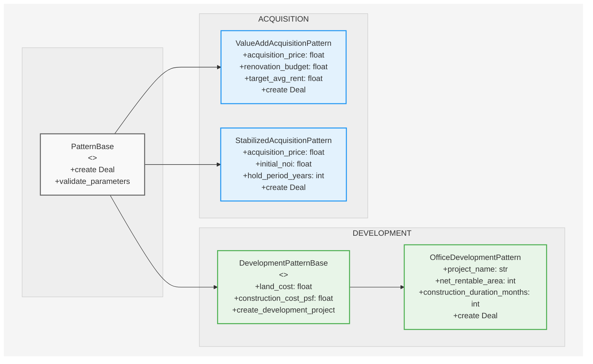

# Performa Patterns

High-level pattern classes that assemble complete Deal objects for immediate analysis, implementing common real estate investment strategies.

## Overview

Patterns represent the highest abstraction layer in Performa's three-tier architecture:

- **Primitives**: Core data models and calculations (timelines, cash flows, etc.)
- **Constructs**: Module-specific builder functions (debt facilities, partnerships, etc.)  
- **Patterns**: Complete investment archetype implementations (value-add, development, etc.)

Patterns reduce complex deal modeling from hundreds of lines of component assembly to parameter-driven class instantiation.

## Architecture Benefits

### Code Reduction

**Component Assembly Approach**:
```python
# 300+ lines of code across multiple functions
property = create_property_with_unit_mix(...)  # 100+ lines
capital_plan = create_renovation_program(...)   # 50+ lines  
absorption = create_absorption_plans(...)       # 75+ lines
financing = create_debt_facilities(...)         # 100+ lines
acquisition = create_acquisition_terms(...)     # 25+ lines
deal = assemble_complete_deal(...)              # 50+ lines
# + parameter coordination and validation
```

**Pattern Approach**:
```python
# 7 lines of code, single class instantiation
pattern = ValueAddAcquisitionPattern(
    property_name="Riverside Gardens",
    acquisition_price=10_000_000,
    renovation_budget=1_500_000,
    target_avg_rent=1700,
    hold_period_years=7,
    ltv_ratio=0.65,
)
deal = pattern.create()
```

### Generated Components

Patterns automatically generate:

- Multi-unit residential properties with lease lifecycle management
- Value-add workflows: REABSORB → Renovation → Absorption
- Capital plans synchronized with lease expiration timing
- Construction-to-permanent debt structures
- Linked components ready for analysis

### Standardization Benefits

- Patterns encode real estate investment strategies
- Reduces modeling errors across teams
- Enables business users to model deals without technical knowledge
- Centralized pattern updates apply to all implementations

## Available Patterns

### Acquisition Patterns

#### `ValueAddAcquisitionPattern`

Models value-add acquisition: acquire underperforming property, execute renovations, hold for cash flow and appreciation, exit via sale.

**Key Parameters**:
- `property_name`: Property identification
- `acquisition_price`: Purchase price ($)
- `acquisition_date`: Acquisition closing date  
- `renovation_budget`: Total renovation investment ($)
- `target_avg_rent`: Target rent after improvements ($/unit/month)
- `hold_period_years`: Investment timeline (years)
- `ltv_ratio`: Loan-to-value ratio for financing

**Generated Components**:
- Residential Property: 100-unit multifamily with mixed unit types (1BR/2BR)
- Rolling Renovation: Units expire with REABSORB behavior for systematic renovation
- Capital Coordination: Renovation program aligned with lease lifecycle  
- Post-Renovation Absorption: Leasing at market rents with improved terms
- Financing Structure: Construction-to-permanent debt facilities
- Component Integration: All components linked for immediate analysis

**Example Usage**:
```python
from datetime import date
from performa.patterns import ValueAddAcquisitionPattern
from performa.deal.api import analyze
from performa.core.primitives import Timeline, GlobalSettings

# Create value-add deal
pattern = ValueAddAcquisitionPattern(
    property_name="Sunrise Apartments",
    acquisition_price=8_500_000,
    acquisition_date=date(2024, 1, 1),
    renovation_budget=1_500_000,
    target_avg_rent=1700,
    hold_period_years=7,
    ltv_ratio=0.65
)

# Generate the deal
deal = pattern.create()

# Run analysis
timeline = Timeline.from_dates("2024-01-01", "2030-12-31")
settings = GlobalSettings()
results = analyze(deal, timeline, settings)

# Access results with full type safety
deal_irr = results.deal_metrics.irr
equity_multiple = results.deal_metrics.equity_multiple
levered_cash_flows = results.levered_cash_flows.levered_cash_flows
```

**Implementation Details**:

1. **Acquisition Phase**: Property acquired with existing tenant base generating current cash flows
2. **Lease Rollover**: Natural lease expirations trigger REABSORB behavior
3. **Renovation Coordination**: Units go offline for 2-month renovation cycles  
4. **Re-leasing**: Renovated units return via absorption plans at target rents
5. **Value Creation**: Systematic NOI improvement through rolling renovation program

**Expected Performance**:
- Renovation Yields: 15-25% annual return on renovation investment
- NOI Growth: 25-40% improvement from acquisition to stabilization
- Property Value Creation: $3-5M+ appreciation (depending on exit cap rates)
- Investment Returns: 18-25% unlevered IRR for typical implementations

#### `StabilizedAcquisitionPattern`

Models acquisition of stabilized, cash-flowing assets for steady income and appreciation.

**Key Parameters**:
- `property_name`: Property identification
- `acquisition_price`: Purchase price ($)
- `initial_noi`: Current net operating income ($)
- `hold_period_years`: Investment timeline (years)
- `ltv_ratio`: Loan-to-value ratio for financing

**Example Usage**:
```python
from performa.patterns import StabilizedAcquisitionPattern

pattern = StabilizedAcquisitionPattern(
    property_name="Metro Office Plaza",
    acquisition_price=15_000_000,
    initial_noi=1_050_000,
    hold_period_years=5,
    ltv_ratio=0.70
)
deal = pattern.create()
```

### Development Patterns

#### `OfficeDevelopmentPattern`

Models ground-up office development from land acquisition through construction, lease-up, and stabilization.

**Key Parameters**:
- `project_name`: Development project identification
- `land_cost`: Land acquisition cost ($)
- `net_rentable_area`: Total leasable square footage
- `construction_cost_psf`: Construction cost per SF ($)
- `target_rent_psf`: Stabilized rent per SF ($/SF/year)
- `construction_duration_months`: Construction timeline
- `hold_period_years`: Post-stabilization hold period

**Generated Components**:
- Office Development Blueprint: Ground-up construction to stabilized operations
- Construction Capital Plan: Coordinated hard/soft costs with draw schedules
- Leasing Program: Absorption modeling with market-driven lease-up
- Construction-to-Permanent Financing: Debt structures with proper transitions
- Development Lifecycle: From construction through operations

**Example Usage**:
```python
from performa.patterns import OfficeDevelopmentPattern

pattern = OfficeDevelopmentPattern(
    project_name="Metro Office Tower",
    land_cost=3_000_000,
    net_rentable_area=45_000,
    construction_cost_psf=280,
    target_rent_psf=45,
    construction_duration_months=18,
    hold_period_years=7,
    ltc_ratio=0.70
)
deal = pattern.create()
```

**Implementation Process**:

1. **Land Acquisition**: Initial land purchase and closing
2. **Construction Phase**: Coordinated hard/soft cost deployment
3. **Pre-leasing**: Marketing and leasing during construction
4. **Delivery & Absorption**: Building delivery with systematic lease-up
5. **Stabilization**: Achievement of target occupancy and operations
6. **Hold & Exit**: Stabilized cash flow period with eventual disposition

## Pattern Architecture

### Pattern Class Hierarchy



*Patterns inherit from PatternBase or specialized bases like DevelopmentPatternBase, providing consistent interfaces for deal creation while supporting different investment strategies.*

### Base Classes

#### `PatternBase`

Abstract base class providing common functionality for all patterns:

```python
from performa.patterns.base import PatternBase
from performa.deal import Deal
from datetime import date

class CustomPattern(PatternBase):
    # Pattern-specific parameters
    project_name: str
    budget: float
    
    def create(self) -> Deal:
        """Create a complete Deal object from pattern parameters."""
        # Implementation specific to pattern
        pass
```

#### `DevelopmentPatternBase`

Specialized base class for development patterns with development-specific functionality:

```python
from performa.patterns.base import DevelopmentPatternBase

class CustomDevelopmentPattern(DevelopmentPatternBase):
    # Development-specific parameters
    land_cost: float
    construction_cost_psf: float
    
    def create(self) -> Deal:
        """Create a complete development Deal object."""
        # Development-specific implementation
        pass
```

### Pattern Validation

All patterns undergo validation:

1. **Parameter Usage**: Every input parameter affects deal structure
2. **Strategy Logic**: Investment approach correctly implemented in component relationships  
3. **Analysis Integration**: Generated deals run successfully through analysis engine
4. **Financial Validation**: Outputs align with industry benchmarks and expectations
5. **Equivalence Testing**: Pattern outputs verified against manual component construction

## Integration with Analysis

Patterns integrate with Performa's analysis and reporting systems:

```python
from performa.patterns import ValueAddAcquisitionPattern
from performa.deal.api import analyze
from performa.core.primitives import Timeline, GlobalSettings

# Pattern → Analysis → Results workflow
pattern = ValueAddAcquisitionPattern(...)     # Pattern Definition
deal = pattern.create()                       # Deal Generation
results = analyze(deal, timeline, settings)   # Analysis Engine

# Access all analysis components with full type safety
partnership_returns = results.partner_distributions
debt_analysis = results.financing_analysis  
property_performance = results.unlevered_analysis
deal_metrics = results.deal_metrics
```

## Best Practices

### When to Use Patterns

**Ideal Use Cases**:
- Rapid deal modeling and iteration during underwriting
- Standardized investment strategy implementation across portfolios
- Business user deal creation without technical knowledge
- Teaching and demonstration of real estate investment concepts
- Baseline scenarios for sensitivity analysis and stress testing

**Consider Component Construction When**:
- Implementing novel or highly customized investment strategies
- Requiring granular control over specific component relationships
- Building new pattern templates for future standardization
- Debugging complex deal structures or unusual performance issues

### Pattern Extension

Patterns are designed for extension and customization:

```python
# Start with standard pattern
pattern = ValueAddAcquisitionPattern(...)
base_deal = pattern.create()

# Customize specific components
base_deal.asset.expenses = create_custom_expense_model(...)
base_deal.financing = create_specialized_debt_structure(...)

# Maintain pattern benefits with targeted modifications
```

### Testing Pattern Equivalence

Compare pattern-generated deals with manual composition:

```python
# Pattern approach
pattern = ValueAddAcquisitionPattern(...)
pattern_deal = pattern.create()
pattern_results = analyze(pattern_deal, timeline, settings)

# Manual composition approach  
composition_deal = create_deal_via_manual_composition(...)
composition_results = analyze(composition_deal, timeline, settings)

# Verify equivalence
assert abs(pattern_results.deal_metrics.irr - composition_results.deal_metrics.irr) < 0.0001
assert abs(pattern_results.deal_metrics.equity_multiple - composition_results.deal_metrics.equity_multiple) < 0.0001
```

## Development Status

### Current Implementation Status

✅ **Fully Implemented**:
- `ValueAddAcquisitionPattern`: Complete implementation with validation
- `OfficeDevelopmentPattern`: Complete office development lifecycle modeling
- `StabilizedAcquisitionPattern`: Complete stabilized acquisition modeling

🚧 **In Development**:
- `ResidentialDevelopmentPattern`: Planned for residential development projects
- Additional asset-specific development patterns (retail, industrial, mixed-use)

### Future Development

#### Planned Patterns

- **Opportunistic Strategies**: Distressed asset and special situation patterns
- **Portfolio Patterns**: Multi-asset and fund-level investment strategies
- **Mixed-Use Development**: Mixed-use project patterns
- **Build-to-Rent**: Residential development for rental operations

#### Enhancement Roadmap

- **Sensitivity Integration**: Built-in sensitivity analysis for key parameters
- **Market Data Connections**: Dynamic parameter updating from market data sources
- **Strategy Optimization**: Parameter tuning for target return profiles
- **Custom Pattern Builder**: Tools for creating organization-specific patterns

## Contributing

New patterns should follow established conventions:

1. **Class Design**: Inherit from appropriate base class (`PatternBase` or `DevelopmentPatternBase`)
2. **Parameter Validation**: Use Pydantic field validators for business rule validation
3. **Documentation**: Docstrings with examples and expected performance
4. **Testing**: Unit tests covering pattern creation, analysis integration, and edge cases
5. **Equivalence**: Demonstration of equivalence to manual component construction

### Pattern Development Template

```python
from performa.patterns.base import PatternBase
from performa.deal import Deal
from pydantic import Field, field_validator

class NewPattern(PatternBase):
    """Description of the investment strategy this pattern implements."""
    
    # Required parameters
    parameter_one: float = Field(description="Description of parameter one")
    parameter_two: str = Field(description="Description of parameter two")
    
    @field_validator('parameter_one')
    @classmethod
    def validate_parameter_one(cls, v):
        """Validate parameter_one meets business rules."""
        if v <= 0:
            raise ValueError("parameter_one must be positive")
        return v
    
    def create(self) -> Deal:
        """Create a complete Deal object from pattern parameters.
        
        Returns:
            Fully configured Deal object ready for analysis
            
        Raises:
            ValueError: If parameters cannot create a valid deal
        """
        # Implementation details
        pass
```

New patterns should demonstrate productivity benefits while maintaining full modeling capability and passing validation testing.